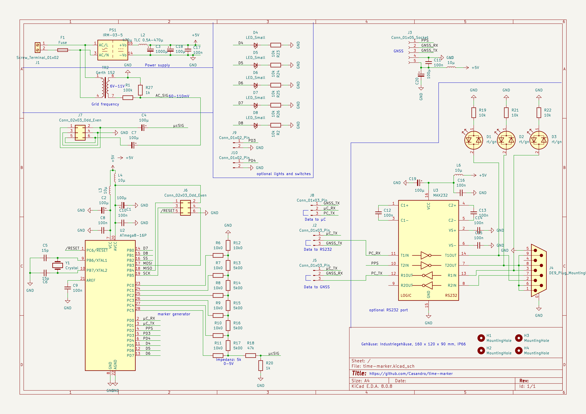
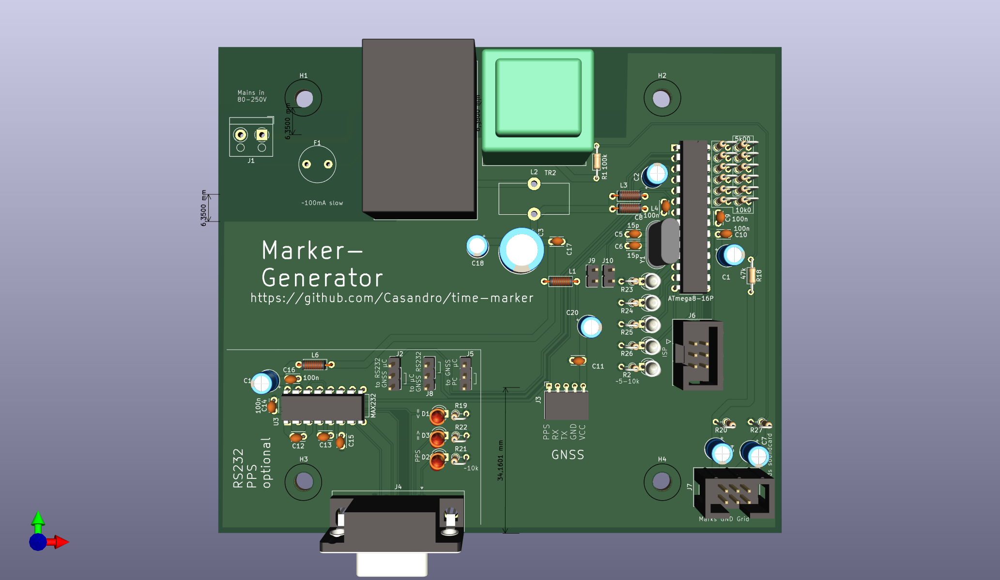

## Time Marker

This is a small device designed to monitor the frequency of power grids.
It consists of a piece of hardware which generates GNSS synced audio markers, and isolates and down-scales it so both can be fed into a sound-card.

From there software will read the markers and generate down-sampled, but propperly timed audio files.

